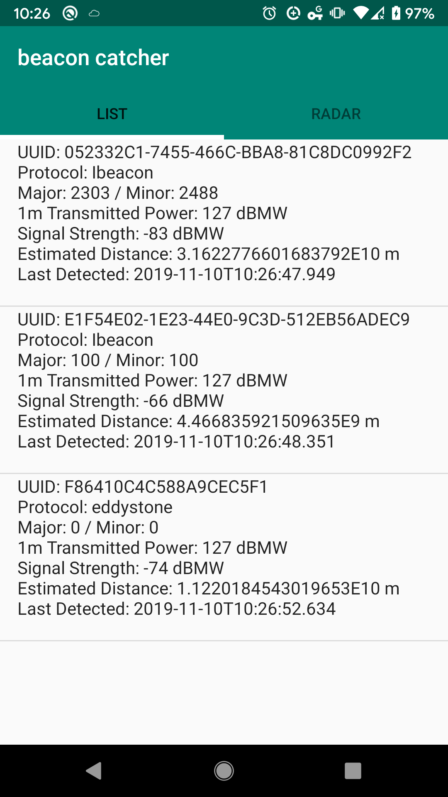

- [1M Transmitted Power(TxPower)](https://stackoverflow.com/a/36867888/432903), aka measured power/ 1M expected power
- Radio Signal Strength Indicator
- [deciBel Milliwatts](https://en.wikipedia.org/wiki/DBm), https://support.kontakt.io/hc/en-gb/articles/201621521-Transmission-power-Range-and-RSSI



BLE Range (txPower)
--

Choosing a transmit power level is a design tradeoff between range and power consumption.

https://www.bluetooth.com/bluetooth-technology/range/?utm_source=tw&utm_medium=social&utm_term=social&utm_content=tw-btrange-org&utm_campaign=range

Layouts
------

* [iBeacon](https://developer.apple.com/ibeacon/)
----

- http://www.havlena.net/en/location-technologies/ibeacons-how-do-they-technically-work/
- https://support.kontakt.io/hc/en-gb/articles/201492492-iBeacon-advertising-packet-structure

```bash
m:2-3=0215,i:4-19,i:20-21,i:22-23,p:24-24
```

23 bytes

```bash
2019-12-01 11:57:30.830 1055-1055/com.duwamish.radio.transmitter I/IBeaconScanApi: validated Ibeacon BLE for ScanRecord 
[
    mAdvertiseFlags=6, 
    mServiceUuids=null, 
    mServiceSolicitationUuids=[], 
    mManufacturerSpecificData={76=[2, 21, -31, -11, 78, 2, 30, 35, 68, -32, -100, 61, 81, 46, -75, 106, -34, -55, 0, 100, 0, 100, -71]}, 
    mServiceData={}, 
    mTxPowerLevel=-2147483648, 
    mDeviceName=null
]

```

https://beaconlayout.wordpress.com

* [eddystone](https://developers.google.com/beacons/eddystone)
----

- [https://github.com/google/eddystone/tree/master/eddystone-uid](https://github.com/google/eddystone/tree/master/eddystone-uid)

eg.

```bash
2019-11-22 20:28:53.777 18017-18017/com.duwamish.radio.transmitter I/com.duwamish.radio.transmitter.layouts.EddystoneScanApi$Companion: validating if eddystone for scanResult ScanRecord 
[
    mAdvertiseFlags=6, 
    mServiceUuids=[0000feaa-0000-1000-8000-00805f9b34fb], 
    mServiceSolicitationUuids=[], 
    mManufacturerSpecificData={},
    mServiceData={0000feaa-0000-1000-8000-00805f9b34fb=[0, -58, -8, 100, 16, -60, -59, -120, -87, -50, -59, -15, 0, -112, 0, 1, 21, 35, 0, 0]}, 
    mTxPowerLevel=-2147483648, 
    mDeviceName=null
]
```

FIXME
----

```bash
2019-09-07 15:27:09.293 14718-14718/com.duwamish.radio.transmitter I/zygote: Rejecting re-init on previously-failed class java.lang.Class<android.support.v4.view.ViewCompat$OnUnhandledKeyEventListenerWrapper>: java.lang.NoClassDefFoundError: Failed resolution of: Landroid/view/View$OnUnhandledKeyEventListener;
2019-09-07 15:27:09.293 14718-14718/com.duwamish.radio.transmitter I/zygote:     at void android.support.v4.view.ViewCompat.setOnApplyWindowInsetsListener(android.view.View, android.support.v4.view.OnApplyWindowInsetsListener) (ViewCompat.java:2203)
2019-09-07 15:27:09.293 14718-14718/com.duwamish.radio.transmitter I/zygote:     at android.view.ViewGroup android.support.v7.app.AppCompatDelegateImpl.createSubDecor() (AppCompatDelegateImpl.java:637)
2019-09-07 15:27:09.293 14718-14718/com.duwamish.radio.transmitter I/zygote:     at void android.support.v7.app.AppCompatDelegateImpl.ensureSubDecor() (AppCompatDelegateImpl.java:518)
2019-09-07 15:27:09.293 14718-14718/com.duwamish.radio.transmitter I/zygote:     at void android.support.v7.app.AppCompatDelegateImpl.setContentView(int) (AppCompatDelegateImpl.java:466)
2019-09-07 15:27:09.293 14718-14718/com.duwamish.radio.transmitter I/zygote:     at void android.support.v7.app.AppCompatActivity.setContentView(int) (AppCompatActivity.java:140)
2019-09-07 15:27:09.293 14718-14718/com.duwamish.radio.transmitter I/zygote:     at void com.duwamish.radio.transmitter.BeaconCatcherController.onCreate(android.os.Bundle) (BeaconCatcherController.kt:46)
2019-09-07 15:27:09.293 14718-14718/com.duwamish.radio.transmitter I/zygote:     at void android.app.Activity.performCreate(android.os.Bundle, android.os.PersistableBundle) (Activity.java:6999)
2019-09-07 15:27:09.293 14718-14718/com.duwamish.radio.transmitter I/zygote:     at void android.app.Activity.performCreate(android.os.Bundle) (Activity.java:6990)
2019-09-07 15:27:09.293 14718-14718/com.duwamish.radio.transmitter I/zygote:     at void android.app.Instrumentation.callActivityOnCreate(android.app.Activity, android.os.Bundle) (Instrumentation.java:1214)
2019-09-07 15:27:09.293 14718-14718/com.duwamish.radio.transmitter I/zygote:     at android.app.Activity android.app.ActivityThread.performLaunchActivity(android.app.ActivityThread$ActivityClientRecord, android.content.Intent) (ActivityThread.java:2731)
2019-09-07 15:27:09.294 14718-14718/com.duwamish.radio.transmitter I/zygote:     at void android.app.ActivityThread.handleLaunchActivity(android.app.ActivityThread$ActivityClientRecord, android.content.Intent, java.lang.String) (ActivityThread.java:2856)
2019-09-07 15:27:09.294 14718-14718/com.duwamish.radio.transmitter I/zygote:     at void android.app.ActivityThread.-wrap11(android.app.ActivityThread, android.app.ActivityThread$ActivityClientRecord, android.content.Intent, java.lang.String) (ActivityThread.java:-1)
2019-09-07 15:27:09.294 14718-14718/com.duwamish.radio.transmitter I/zygote:     at void android.app.ActivityThread$H.handleMessage(android.os.Message) (ActivityThread.java:1589)
2019-09-07 15:27:09.294 14718-14718/com.duwamish.radio.transmitter I/zygote:     at void android.os.Handler.dispatchMessage(android.os.Message) (Handler.java:106)
2019-09-07 15:27:09.294 14718-14718/com.duwamish.radio.transmitter I/zygote:     at void android.os.Looper.loop() (Looper.java:164)
2019-09-07 15:27:09.294 14718-14718/com.duwamish.radio.transmitter I/zygote:     at void android.app.ActivityThread.main(java.lang.String[]) (ActivityThread.java:6494)
2019-09-07 15:27:09.294 14718-14718/com.duwamish.radio.transmitter I/zygote:     at java.lang.Object java.lang.reflect.Method.invoke(java.lang.Object, java.lang.Object[]) (Method.java:-2)
2019-09-07 15:27:09.294 14718-14718/com.duwamish.radio.transmitter I/zygote:     at void com.android.internal.os.RuntimeInit$MethodAndArgsCaller.run() (RuntimeInit.java:438)
2019-09-07 15:27:09.294 14718-14718/com.duwamish.radio.transmitter I/zygote:     at void com.android.internal.os.ZygoteInit.main(java.lang.String[]) (ZygoteInit.java:807)
2019-09-07 15:27:09.294 14718-14718/com.duwamish.radio.transmitter I/zygote: Caused by: java.lang.ClassNotFoundException: Didn't find class "android.view.View$OnUnhandledKeyEventListener" on path: DexPathList[[zip file "/data/app/com.duwamish.radio.transmitter-FtcoIOHH2kvjqqHIpQiWGw==/base.apk", zip file "/data/app/com.duwamish.radio.transmitter-FtcoIOHH2kvjqqHIpQiWGw==/split_lib_dependencies_apk.apk", zip file "/data/app/com.duwamish.radio.transmitter-FtcoIOHH2kvjqqHIpQiWGw==/split_lib_resources_apk.apk", zip file "/data/app/com.duwamish.radio.transmitter-FtcoIOHH2kvjqqHIpQiWGw==/split_lib_slice_0_apk.apk", zip file "/data/app/com.duwamish.radio.transmitter-FtcoIOHH2kvjqqHIpQiWGw==/split_lib_slice_1_apk.apk", zip file "/data/app/com.duwamish.radio.transmitter-FtcoIOHH2kvjqqHIpQiWGw==/split_lib_slice_2_apk.apk", zip file "/data/app/com.duwamish.radio.transmitter-FtcoIOHH2kvjqqHIpQiWGw==/split_lib_slice_3_apk.apk", zip file "/data/app/com.duwamish.radio.transmitter-FtcoIOHH2kvjqqHIpQiWGw==/split_lib_slice_4_apk.apk", zip file "/data/app/com.duwamish.radio.transmitter-FtcoIOHH2kvjqqHIp
2019-09-07 15:27:09.295 14718-14718/com.duwamish.radio.transmitter I/zygote:     at java.lang.Class dalvik.system.BaseDexClassLoader.findClass(java.lang.String) (BaseDexClassLoader.java:125)
```

run on device
--

- tap `Build number` 7(?) times
- enable Debugging
- restart debug bridge

https://developer.android.com/studio/run/device

example beacon

```bash
2019-09-07 21:33:45.809 7141-7141/com.duwamish.radio.transmitter I/StandardBeaconCacther: UUID: P1F54E02-1E23-44P0-9C3D-512PB56ADED9\nmajor: 100\nminor100
```
build artifact
---------------

```bash
./gradlew clean ##make sure to run before installing in device
```

- https://developer.android.com/studio/build/building-cmdline


TODOs
-----

- find device distance 
- find user direction from beacon
- UI to show beacons

references
---

- https://github.com/kiteflo/iBeaconAndroidDemo
- https://developer.radiusnetworks.com/2015/09/29/is-your-beacon-app-ready-for-android-6.html
- https://github.com/Bridouille/android-beacon-scanner
- https://github.com/TakahikoKawasaki/nv-bluetooth
- http://cseweb.ucsd.edu/classes/fa06/cse237a/finalproj/almula.pdf
- https://iotandelectronics.wordpress.com/2016/10/07/how-to-calculate-distance-from-the-rssi-value-of-the-ble-beacon/
- https://www.quora.com/What-does-negative-numbers-on-the-decibel-scale-mean

- https://stackoverflow.com/questions/20332856/triangulate-example-for-ibeacons
- https://www.bluetooth.com/bluetooth-resources/enhancing-bluetooth-location-services-with-direction-finding/
- https://3pl46c46ctx02p7rzdsvsg21-wpengine.netdna-ssl.com/wp-content/uploads/2019/03/1901_Enhancing-Bluetooth-Location-Service_FINAL.pdf

- https://accent-systems.com/wp-content/uploads/iBKS105_datasheet_rev1.pdf
- [Understanding ibeacon distancing](https://stackoverflow.com/a/21617601/432903)

use cases
---------
- https://runwaygirlnetwork.com/2014/06/18/american-turns-beacons-improve-passenger-experience/